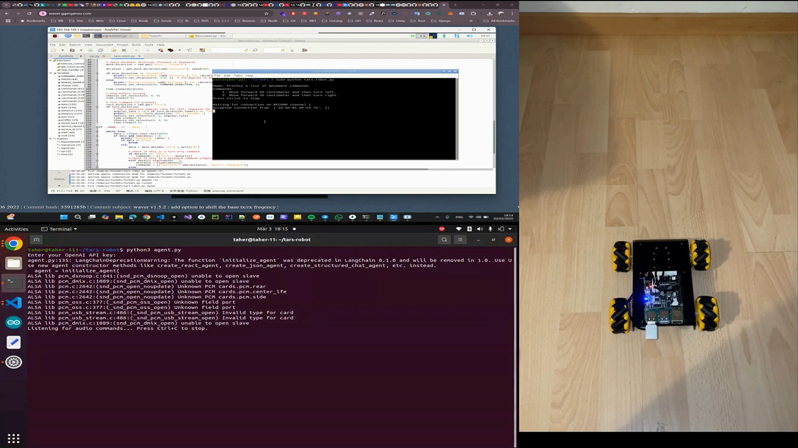
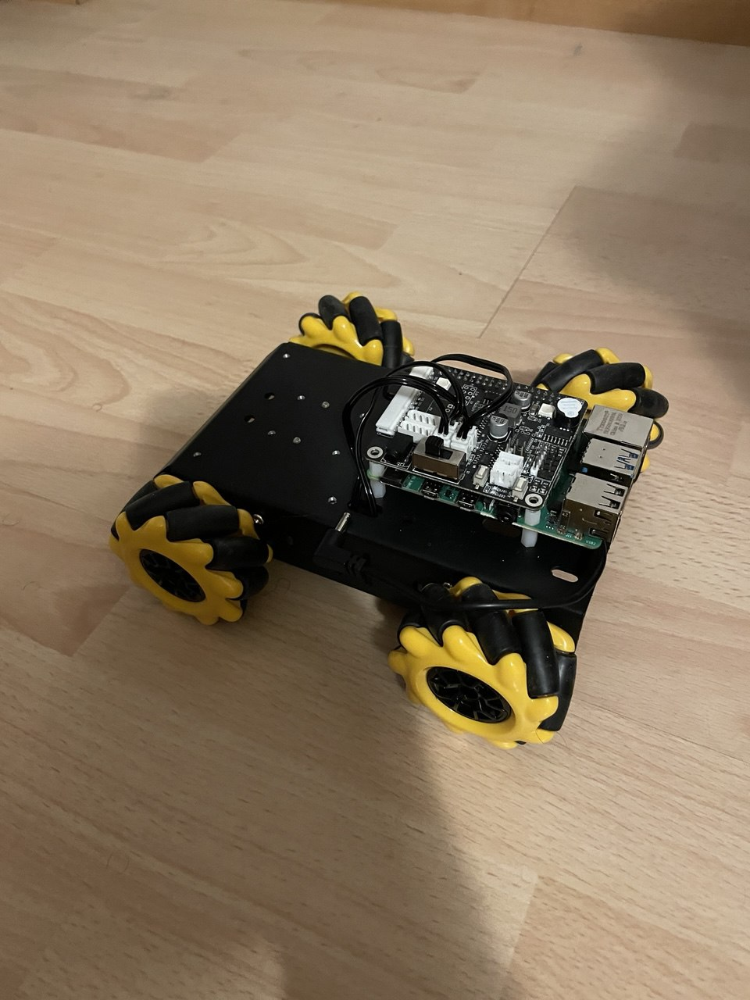

# TARS Robot

**TARS Robot**: AI-Agent Data-over-Sound Commads and Bluetooth-Controlled Mecanum Chassis 🤖

## Demo Video
[](https://youtu.be/kBwK15pydL0)

- **Audio Decoding** via [ggwave](https://github.com/ggerganov/ggwave) to capture and decode sound-based commands.
- **Natural Language Processing** with [LangChain](https://github.com/langchain-ai/langchain) and OpenAI’s GPT-4 to interpret user commands.
- **Bluetooth Communication** using [PyBluez](https://github.com/pybluez/pybluez) to send movement instructions.
- **Mecanum Chassis Control** for precise movement on a robot with mecanum wheels.
- **Raspberry Pi Hardware** serves as the central processing unit of the robot, handling all computational tasks and coordinating the various systems.

## Features

- **Audio Command Processing**: Listen to audio commands through a microphone, decode them with ggwave, and convert the audio to text.
- **Intelligent Command Interpretation**: Leverage LangChain with OpenAI’s ChatGPT to parse and validate natural language commands (e.g., “forward 40 cm and turn right”).
- **Bluetooth-based Communication**: Send movement commands from the controller to the robot over an RFCOMM Bluetooth connection.
- **Robot Movement Execution**: On the robot side, interpret incoming commands and execute them via a custom mecanum chassis implementation.

## Project Structure

- **agent.py**  
  - Listens for audio commands using `pyaudio` and decodes them with `ggwave`.
  - Processes commands with a LangChain agent that uses a custom tool (`robot_movement`) for parsing movement instructions.
  - Sends formatted commands to the robot via Bluetooth.

- **tars-robot.py**  
  - Runs on the robot (or its controlling device), waiting for Bluetooth commands.
  - Decodes received commands and translates them into movement actions using the HiwonderSDK’s mecanum module.
  - Supports commands for moving forward/backward and turning.

- **mecanum.py**  
  - Implements the `MecanumChassis` class to compute motor control signals from polar movement parameters.
  - Converts velocity, direction, and angular rates into individual motor speeds.

- **board.py**  
  - Provides low-level functions to control motors, servos, and other hardware components via I2C and GPIO.
  - Interfaces with the Raspberry Pi hardware and any attached motor controllers.

## Prerequisites

- **Hardware**:
  - A Raspberry Pi (or similar device) with Bluetooth and audio input support.
  - A robot chassis equipped with mecanum wheels and compatible motor drivers.
  - A microphone for audio command capture.
  
- **Software**:
  - [ggwave](https://github.com/ggerganov/ggwave)
  - [PyAudio](https://people.csail.mit.edu/hubert/pyaudio)
  - [PyBluez](https://github.com/pybluez/pybluez)
  - [LangChain](https://github.com/langchain-ai/langchain)

## Installation

1. **Clone the Repository**:
   ``` bash
   git clone https://github.com/taherfattahi/tars-robot.git
   cd tars-robot
   ```

2. **Install Dependencies:** Install required packages:

    ``` bash
    sudo apt-get install portaudio19-dev python-pyaudio python3-pyaudio
    ```
    ``` bash
    pip install ggwave pyaudio pybluez langchain langchain_openai
    ```

3. **Set Up Hardware:**

- Ensure your Raspberry Pi is set up with the necessary hardware (microphone, Bluetooth adapter, motor drivers).

## Usage
1. **Running the Command Processor**
On your controller device (e.g., a Raspberry Pi acting as the command center), run the following:

    ```bash
    python agent.py
    ```
- The script listens for audio commands via the microphone.
- It decodes audio using ggwave and processes the command using a LangChain agent.
- Processed commands and then sent over Bluetooth to the robot.
- Note: You will be prompted to enter your OpenAI API key.

1. **Running the Robot Control Script**
On the robot (or its dedicated controller), run:

    ```bash
    python tars-robot.py
    ```

- The script sets up an RFCOMM Bluetooth server and waits for incoming commands.
- Upon receiving a command, it decodes the message and uses the mecanum module (via mecanum.py) to execute movement.
  
## Command Examples
https://waver.ggerganov.com

System supports natural language commands transmitted via the Waver website, which leverages ggwave's audio data-over-sound capabilities. Audio signals are captured through a microphone, decoded into text by ggwave, and then processed by your LangChain agent before being sent via Bluetooth to the robot.

Example commands: 
- ```Move the robot forward 25 centimeters and then turn left```
- ```Turn right now```
- ```Move the robot backward 25 centimeters```



## Resources
- [ggwave](https://github.com/ggerganov/ggwave) – For the innovative audio data-over-sound library.
- [PyBluez](https://github.com/pybluez/pybluez) – For enabling Bluetooth communication.
- [LangChain](https://github.com/langchain-ai/langchain) and [OpenAI](https://platform.openai.com/docs/overview) – For powering natural language command interpretation.

## Contact
For questions, feedback, or contributions, please open an issue on GitHub or contact [taherfattahi11@gmail.com](mailto:taherfattahi11@gmail.com).